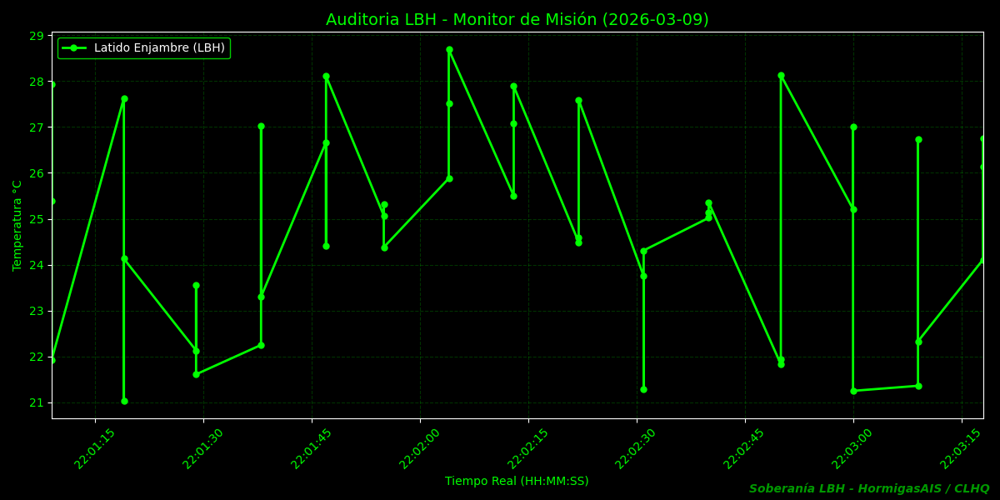

# 🐜 HormigasAIS AirCity — Protocolo de Autorización Soberana UTM

**Fundador:** Cristhiam Leonardo Hernández Quiñonez (CLHQ)  
**Protocolo:** LBH (Lenguaje Binario HormigasAIS) v1.1  
**Estado:** Producción Soberana | Nodo activo en El Salvador  

---

## ¿Qué es HormigasAIS AirCity?

Un protocolo de autorización de tráfico aéreo que no depende de servidores centrales.
Cada dron, camión o vehículo lleva su feromona LBH firmada criptográficamente.
El nodo local valida el ADN digital sin internet. Si el servidor cae, la soberanía persiste.

---

## Diccionario de Comandos LBH

| Código | Nombre | Significado |
|--------|--------|-------------|
| `0x00` | NULL_TRAIL | Nodo en stand-by |
| `0x01` | PULSE_HEART | Latido soberano activo |
| `0x10` | PATH_CLEAR | Espacio aéreo despejado |
| `0x22` | ALERT_WIND | Viento excesivo — drones en tierra |
| `0x77` | MED_PRIORITY | Emergencia médica — prioridad absoluta |
| `0xFF` | SOVEREIGN_LOCK | Bloqueo total — intervención manual |

---

## Niveles de Acceso

### 🆓 Freemium — Nodo Centinela Personal
- Un dispositivo Android con Termux
- Protocolo LBH v1.0
- Comandos básicos: `0x01`, `0x10`
- Sin SLA
- **Para:** desarrolladores, pilotos individuales

### ⚡ Premium — Colonia Operativa
- Hasta 3 nodos coordinados
- LBH v1.1 completo — anti-replay + rotación de claves
- Comandos completos incluyendo `0x77` emergencias médicas
- Gateway Go con webhook HMAC-SHA256
- Soporte via feromona XOXO
- **Para:** flotas pequeñas, municipios, zonas industriales

### 🏛️ Enterprise — Soberanía Total
- Nodos ilimitados
- Protocolo LBH personalizado con firma CLHQ dedicada
- Integración con hardware de vuelo real
- Auditoría con DOI Zenodo verificable
- SLA soberano — sin dependencia de terceros
- **Para:** gobiernos, aeropuertos, operadores UTM regionales

---

## Arquitectura
A20s (CAPULLO_EMISOR)
→ emite feromona BLE: "S9-DATA-IMMUNE-2026"
→ firma LBH con HMAC-SHA256
A16 (CENTINELA)
→ escanea BLE cada 0.5s
→ requiere MATCHES >= 2 (consenso anti-ruido)
→ activa SOBERANÍA CONFIRMADA (7/7)
Gateway Go (proto-v1)
→ valida feromona XOXO firmada con CLHQ
→ sincroniza la Colonia
---

## Verificación Independiente

- **Wire Format:** reproducible sin hardware
- **AES-256-GCM:** cifrado autenticado anti-tampering
- **Suite 5/5:** anti-replay, firma falsa, mensaje expirado — todos bloqueados
- **DOI Zenodo:** [10.5281/zenodo.17767205](https://zenodo.org/records/17767205)

---

## Contacto Soberano

**CLHQ** — Cristhiam Leonardo Hernández Quiñonez  
**Protocolo:** LBH v1.1 | **Nodo:** A16-Soberano-Salvador  
**Infraestructura:** HormigasAIS Gitea Local | El Salvador 2026

## 🔗 Microservicio LBH

| Componente | Repo | Puerto |
|---|---|---|
| lbh-node-service | [GitHub](https://github.com/HormigasAIS/lbh-node-service) | REST:8100 / gRPC:7100 |


## 🗺️ Arquitectura del Ecosistema AirCity

```
┌─────────────────────────────────────────────────────────────┐
│              HormigasAIS AirCity — Ecosistema Soberano       │
├─────────────────────────────────────────────────────────────┤
│   CAPA FÍSICA                                                │
│   └── CENTINELA_V24 (BLE — Heptágono 7 castas)              │
│        │  Escaneo BLE continuo — modo ANTIFRÁGIL            │
│        │  0x01A2B3C4|TS|SIG:hmac                            │
│        ▼                                                     │
│   CAPA PROTOCOLO                                             │
│   └── cmd/bridge_centinela :9001                             │
│        │  Valida HMAC-SHA256 → parsea LBH binario           │
│        ▼                                                     │
│   CAPA SERVICIO                                              │
│   └── lbh-node-service                                       │
│       ├── REST  :8100  → /feromona /feromonas /metrics /ping │
│       ├── gRPC  :7100  → comunicación M2M entre nodos       │
│       └── SQLite       → persistencia soberana local        │
│   CAPA OBSERVABILIDAD                                        │
│   └── /metrics → telemetría en tiempo real                  │
│       ├── total_feromonas / feromonas_ultima_hora           │
│       ├── nodos_activos / ultimo_ts                         │
│   CAPA SOBERANÍA                                             │
│   ├── Gitea local  → HormigasAIS-Colonia-Soberana           │
│   ├── GitHub       → github.com/HormigasAIS                 │
│   └── Backup AES-256 → HormigasAIS-Cofre-Digital            │
│   PILOTO OBJETIVO: Aeropuerto del Pacífico 🇸🇻 2027          │
└─────────────────────────────────────────────────────────────┘
```
| Capa | Componente | Tecnología |
|---|---|---|
| Física | CENTINELA_V24 | Python + BLE |
| Protocolo | LBH-Protocol | Binario propietario |
| Servicio | lbh-node-service | Go + Gin + gRPC |
| Persistencia | SQLite soberano | gorm |
| Observabilidad | /metrics | Go in-memory |
| Soberanía | Gitea + AES-256 | Termux + Android |

## 📊 Evidencia de Rendimiento





